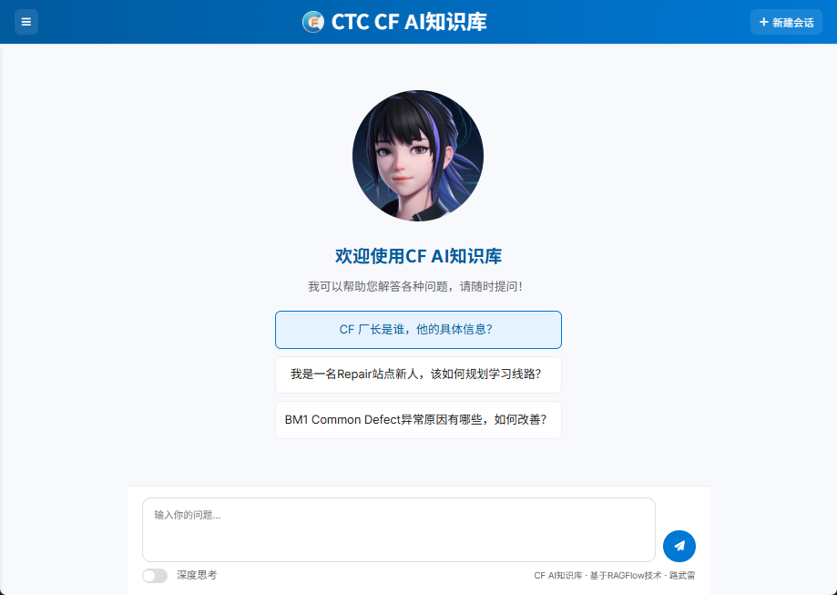

# RAGFlow Chatbot

一个基于 RAGFlow 的智能聊天机器人应用，专为 LCD 彩膜制造领域设计的知识问答系统，也可扩展到其他应用场景。

## 目录
- [项目简介](#项目简介)
- [功能特性](#功能特性)
- [演示](#演示)
- [技术架构](#技术架构)
  - [后端技术栈](#后端技术栈)
  - [前端技术栈](#前端技术栈)
- [项目结构](#项目结构)
- [环境要求](#环境要求)
- [安装与部署](#安装与部署)
  - [方式一：Docker 部署（推荐）](#方式一docker-部署推荐)
  - [方式二：本地开发部署](#方式二本地开发部署)
- [使用说明](#使用说明)
- [API 接口](#api-接口)
- [贡献指南](#贡献指南)
- [许可证](#许可证)

## 项目简介

RAGFlow Chatbot 是一个集成了 RAGFlow 技术的智能问答系统，专注于 LCD 彩膜制造领域的专业知识。该系统能够回答关于工艺诊断、缺陷分析、材料验证和设备优化等方面的问题，为工程师和技术人员提供快速准确的知识支持。

## 功能特性

- 🤖 基于 RAGFlow 的智能问答系统
- 💬 实时流式响应，支持思考过程展示
- 📚 对话历史记录与管理
- 🔍 搜索历史对话
- 📤 导出对话记录
- 🧠 深度思考模式
- 🌐 响应式设计，支持移动端
- 🌙 深色主题支持

## 演示

以下是我们系统的界面展示：



以下是我们系统的常见缺陷查询功能演示：

<video width="100%" controls autoplay loop>
  <source src="https://github.com/raylu123/ragflow-chatbot/blob/main/frontend/demo/common%20defect.mp4" type="video/mp4">
  您的浏览器不支持视频标签。
</video>

## 技术架构

### 后端技术栈
- FastAPI：高性能 Python Web 框架
- SQLAlchemy：ORM 数据库工具
- SQLite：默认数据库存储
- OpenAI SDK：与 RAGFlow API 交互
- Docker：容器化部署

### 前端技术栈
- Vanilla JavaScript：原生 JavaScript 实现
- HTML5/CSS3：现代化界面设计
- SSE（Server-Sent Events）：实时流式通信
- Highlight.js：代码高亮显示
- Marked.js：Markdown 解析


## 项目结构

```
ragflow-chatbot/
├── backend/                 # 后端代码
│   ├── main.py              # 主应用文件
│   ├── models.py            # 数据模型定义
│   ├── crud.py              # 数据库操作
│   ├── rag_client.py        # RAGFlow 客户端
│   └── dockerfile           # 后端 Docker 配置
├── frontend/                # 前端代码
│   ├── static/              # 静态资源
│   │   ├── css/             # 样式文件
│   │   └── js/              # JavaScript 文件
│   └── templates/           # HTML 模板
├── nginx.conf               # Nginx 配置文件
├── docker-compose.yml       # Docker 编排文件
└── README.md                # 项目说明文档
```


## 环境要求

- Docker 和 Docker Compose
- Python 3.8+
- RAGFlow API 访问权限


## 安装与部署

### 方式一：Docker 部署（推荐）

1. 克隆项目代码：
   ```bash
   git clone <repository-url>
   cd ragflow-chatbot
   ```

2. 配置环境变量：
   ```bash
   cp .env.example .env
   # 编辑 .env 文件，填入 RAGFlow 相关配置
   ```

3. 启动服务：
   ```bash
   docker-compose up -d
   ```

4. 访问应用：  
   打开浏览器访问 http://localhost:8080


### 方式二：本地开发部署

1. 安装依赖：
   ```bash
   pip install -r backend/requirements.txt
   ```

2. 配置环境变量：
   ```bash
   cp .env.example .env
   # 编辑 .env 文件，填入 RAGFlow 相关配置
   ```

3. 启动后端服务：
   ```bash
   uvicorn backend.main:app --host 0.0.0.0 --port 8000
   ```

4. 访问应用：  
   打开浏览器访问 http://localhost:8000


## API 接口

| 接口 | 方法 | 描述 |
|------|------|------|
| `/chat` | POST | 发送聊天消息 |
| `/history` | GET | 获取聊天历史 |
| `/history` | POST | 保存聊天记录 |
| `/history/{session_id}` | DELETE | 删除指定会话 |


### 请求示例

1. 发送聊天消息：
   ```bash
   curl "http://localhost:8000/chat?message=CF%20厂长是谁？"
   ```

2. 获取对话历史：
   ```bash
   curl "http://localhost:8000/history"
   ```


## 配置说明

在 `.env` 文件中配置以下环境变量：
```env
RAGFLOW_API_KEY=your_api_key_here
RAGFLOW_BASE_URL=your_ragflow_base_url
RAGFLOW_CHAT_ID=your_chat_id
DATABASE_URL=sqlite:///./chat_history.db
```


## 数据库设计

### ChatSession 表（存储对话会话信息）
- id: 主键
- session_id: 会话唯一标识
- title: 会话标题
- created_at: 创建时间
- updated_at: 更新时间

### ChatMessage 表（存储对话消息）
- id: 主键
- session_id: 关联的会话ID
- role: 角色（user/assistant）
- content: 消息内容
- thinking_content: 思考过程内容
- timestamp: 时间戳


## 故障排除

### 常见问题
1. **无法连接到 RAGFlow 服务**
   - 检查 `.env` 文件中的配置是否正确
   - 确认网络连接正常
   - 验证 RAGFlow 服务是否正常运行

2. **数据库错误**
   - 检查 `DATABASE_URL` 配置
   - 确认数据库文件权限
   - 查看日志文件获取详细错误信息

3. **前端页面无法加载**
   - 检查 Nginx 配置
   - 确认静态文件路径正确
   - 查看浏览器控制台错误信息

### 查看日志
```bash
# 查看后端服务日志
docker-compose logs backend

# 查看 Nginx 日志
docker-compose logs nginx
```


## 贡献指南
1. Fork 本项目
2. 创建功能分支 (`git checkout -b feature/AmazingFeature`)
3. 提交更改 (`git commit -m 'Add some AmazingFeature'`)
4. 推送到分支 (`git push origin feature/AmazingFeature`)
5. 开启 Pull Request


## 许可证
本项目采用 Apache License 2.0 许可证，详情请见 LICENSE 文件。


## 联系方式
项目维护者：raylu123


## 鸣谢
- 感谢 RAGFlow 提供强大的 AI 能力支持
- 感谢所有为项目贡献的开发者